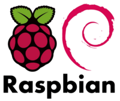

# Genesis

Rather than letting kids play on a more or less shady public Minecraft
server, let's host it ourselves.

This gives us a lot more visibility over who they interact with, and
who knows perhaps an opportunity to show them a software engineering
trick or two.

First option, use this inexpensive Raspberry Pi lying around.
```
$ cat /proc/device-tree/model
Raspberry Pi 3 Model B Rev 1.2
```




An alternate option would be to run our Minecraft server on
[GKE](https://cloud.google.com/kubernetes-engine/), but it will be more
expensive. More peachy as well.
But then forget about the hope of getting the kids interested in how
this thing works.
Or not. Something to think about.

# Spigot as Minecraft server


[Spigot](https://www.spigotmc.org/) is an optimized Minecraft server
that runs on Raspberry Pi.
It is also a nice way to get introduced to Java.

# NFS for storage

To avoid wearing the Pi's card too quickly, we are using NFS and automount.
One entry in `/etc/auto.master`:
```
/misc	/etc/myserver.autofs
```
Another one in `/etc/myserver.autofs`:
```
mine	a.b.c.d:/srv/mine
```
where `a.b.c.d` is the IP address of the NFS server, and `/misc/mine`
becomes a very large and dependable stoarge space for the Pi.


On the server side, `/etc/exports` gets a
```
/srv/mine	e.f.g.h(rw,sync,no_subtree_check,anonuid=1002,anongid=1002)
```
where `e.f.g.h` is the IP address of the Raspberry Pi,
and `1002:1002` is the owner of the `/srv/mine` directory.

The point of `anonuid` is to allow _root_ on the Raspberry Pi to do things
in `/srv/mine` - useful when we are using a Saltstack minion for
configuration management.

# Gitlab for CI/CD

Typical journey:
- Compile Spigot on the Raspberry Pi
- Realize that you will never be able to compile while Minecraft is in use (Minecraft really needs the maximum amount of RAM it can get)
- Start noticing that Spigot revisions do not describe a unique piece of software, so revision control really has to happen on **your** side
- Then notice that managing worlds, especially with demanding users, requires care... hence automation and tight configuration management
- Go Gitlab. 

## Docker Gitlab runners

The Docker runners tagged `docker` [run in Docker containers](https://docs.gitlab.com/runner/install/docker.html) and do most of the work.

They have access to a Docker volume called `minecraft-world` containing
test worlds:
```
[[runners]]
  name = "docker-runner"
  url = "https://gitlab.example.com"
  token = "MyToken"
  executor = "docker"
  environment = ["GODEBUG=netdns=cgo"]
  [runners.docker]
    tls_verify = false
    image = "docker:latest"
    privileged = false
    disable_cache = false
    volumes = ["/var/run/docker.sock:/var/run/docker.sock", "/cache", "minecraft-world:/world" ]
    links = ["gitlab_gitlab_1:gitlab.example.com"]
    shm_size = 0
  [runners.cache]
```


A `cron` job takes care of updating the test worlds:
```
latest_build=$(ls -d /srv/mine/build-* | tail -1) && docker run --user root --rm -v ${latest_build}/world/:/world_from -v minecraft-world:/world_to debian-ci rsync -a --delete /world_from/ /world_to
```

## Shell Gitlab runners

The Docker runners tagged `salt-master` run [bare metal](https://docs.gitlab.com/runner/executors/shell.html)
with direct access to the Salt master.

## debian-ci-java

`Dockerfile-debian-java-ci` describes the Docker image tasked
with building Spigot.
It is executed as part of a separate Gitlab pipeline so that the container
is refreshed every week, but that's another story for another time.

# Saltstack for Configuration Management

[Saltstack](https://repo.saltstack.com/#raspbian) it is, as it runs beautifully on [Raspbian](https://www.raspberrypi.org/downloads/raspbian/).

